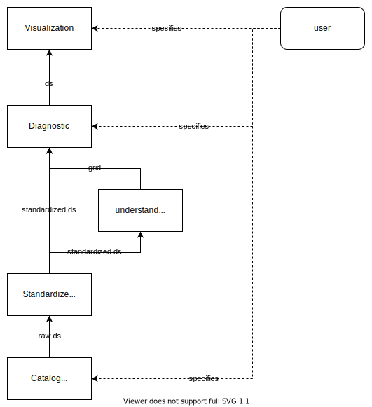

# ESM-VFC

Meta Project for the Virtual Field Campaign Task of ESM

## Use cases

There's a few [user stories](stories/esm-vfc-stories) that we use to understand what to build.

## Structure of the Github org

- Data catalogs are in: <https://github.com/ESM-VFC/esm-vfc-catalogs>
- The definition of the compute env is in: <https://github.com/ESM-VFC/esm-vfc-stacks>
- Workflows using the data catalog and the compute env are in: <https://github.com/ESM-VFC/esm-vfc-workflows>

## Layout

### NEMO user session

